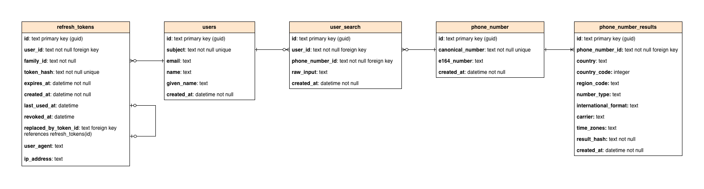
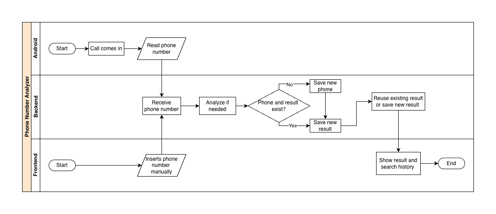

# PNA
Phone Number Analyser is a multi-client system for authenticated phone number lookups. The repository contains:

- a Kotlin/Ktor backend API,
- a React web client,
- an Android call-screening client.

## How to run the application locally

### Backend, frontend, and database

```bash
cp .env.example .env
docker compose up
```

Update these values in `.env` before starting locally:

- **Backend:** `GOOGLE_CLIENT_ID`, `GOOGLE_CLIENT_SECRET`, `JWT_SECRET`
- **Frontend:** `VITE_GOOGLE_CLIENT_ID`
- **PostgreSQL:** `DATABASE_NAME`, `DATABASE_USERNAME`, `DATABASE_PASSWORD` if you do not want the default local Postgres credentials
- **Usually keep as-is for local Compose:** `DATABASE_JDBC_URL=jdbc:postgresql://localhost:5432/pna`, `VITE_API_BASE_URL=http://localhost:8080`

Stop and remove local data with:

```bash
docker compose down -v
```

### Android app

Run Android separately.

```bash
cd android
cp dev.properties.example dev.properties
./gradlew build
```

Then open `android/` in Android Studio and run a Gradle Sync.

Set these values in `android/dev.properties`:

```properties
DEFAULT_SERVER_URL=
GOOGLE_WEB_CLIENT_ID=
```

`DEFAULT_SERVER_URL` must point to a backend URL the emulator or device can reach.

- Android emulator: usually `http://10.0.2.2:8080`
- Real device: use your machine's LAN IP, for example `http://192.168.x.x:8080`

Google OAuth must be configured for the Android client.

## Useful references

- Root overview: `README.md`
- Backend details: `backend/README.md`
- Frontend details: `pna-web/README.md`
- Android details: `android/app/README.md`

# Architecture

The repository is organized into three application modules:

- `backend/` - Ktor API responsible for authentication, phone-number lookup, and PostgreSQL-backed persistence.
- `pna-web/` - React + Vite frontend for browser-based login, number lookup, and history viewing.
- `android/` - Android client that can send incoming phone numbers to the backend from a call-screening flow.

### Backend architecture

The backend follows a layered structure:

- **config** - `backend/src/main/kotlin/config/RootConfig.kt` loads YAML config with Hoplite, then applies environment and `.env` fallbacks.
- **plugins** - `backend/src/main/kotlin/plugins/` configures HTTP/CORS, security, and routing.
- **routes** - `backend/src/main/kotlin/routes/v1/` exposes auth and number APIs.
- **services** - `backend/src/main/kotlin/services/` contains business logic such as JWT issuance, Google auth, refresh-token rotation, cached number lookup, and phone metadata lookup.
- **repositories** - `backend/src/main/kotlin/dal/repositories/` persists users, shared phone-number results, user searches, and refresh tokens in PostgreSQL.
- **database bootstrap** - `backend/src/main/kotlin/dal/PostgresDatabase.kt` initializes the HikariCP pool and runs Liquibase migrations at startup.

`backend/src/main/kotlin/Main.kt` wires the configuration, services, repositories, and routes together before starting a Netty server.

### Web architecture

The web app uses route-driven React composition:

- `pna-web/src/main.tsx` boots the app, creates the TanStack Query client, and registers the PWA service worker.
- `pna-web/src/router.tsx` connects the generated TanStack Router route tree.
- `pna-web/src/routes/__root.tsx` provides the global layout, theme controls, and auth-aware navigation.
- `pna-web/src/routes/index.tsx` is the public entry route and login screen.
- `pna-web/src/routes/search.tsx` is the authenticated lookup page.
- `pna-web/src/api/` contains the shared API client, auth helpers, and number-search requests.

### Android architecture

The Android app is a thin client around backend integration:

- `android/app/src/main/java/com/example/callgrabber/CallService.kt` receives screened calls and forwards the number to the backend.
- `android/app/src/main/java/com/example/callgrabber/AuthInterceptor.kt` adds the stored auth token to requests.
- `android/app/src/main/java/com/example/callgrabber/CallApi.kt` defines the Retrofit API contract.
- `android/dev.properties.example` and `android/app/build.gradle.kts` define local Android runtime configuration.

## Tech stack

### Backend

- Kotlin 2
- Ktor 2 + Netty
- Kotlinx Serialization
- JWT auth (`com.auth0:java-jwt` and Ktor JWT)
- Google auth integration (`google-api-client`)
- Hoplite for configuration loading
- `dotenv-java` for local secret fallback
- PostgreSQL via JDBC driver
- HikariCP connection pooling
- Liquibase schema migrations
- `libphonenumber` for number parsing, carrier, region, and timezone lookup

### Web

- React 19
- TypeScript
- Vite
- TanStack Router
- TanStack Query
- Tailwind CSS v4 + DaisyUI
- `vite-plugin-pwa`
- Vitest
- Biome

### Android

- Kotlin
- Android SDK (`minSdk 27`, `targetSdk 36`)
- Retrofit + Gson converter
- OkHttp interceptor pattern
- Kotlin Coroutines
- Android Credentials API
- Google Identity

## Database schema

The backend now uses PostgreSQL with Liquibase-managed schema changes. The schema source of truth is `backend/src/main/resources/db/changelog/db.changelog-master.yaml`, and `backend/src/main/kotlin/dal/PostgresDatabase.kt` applies migrations automatically on startup.



## Flowchart


